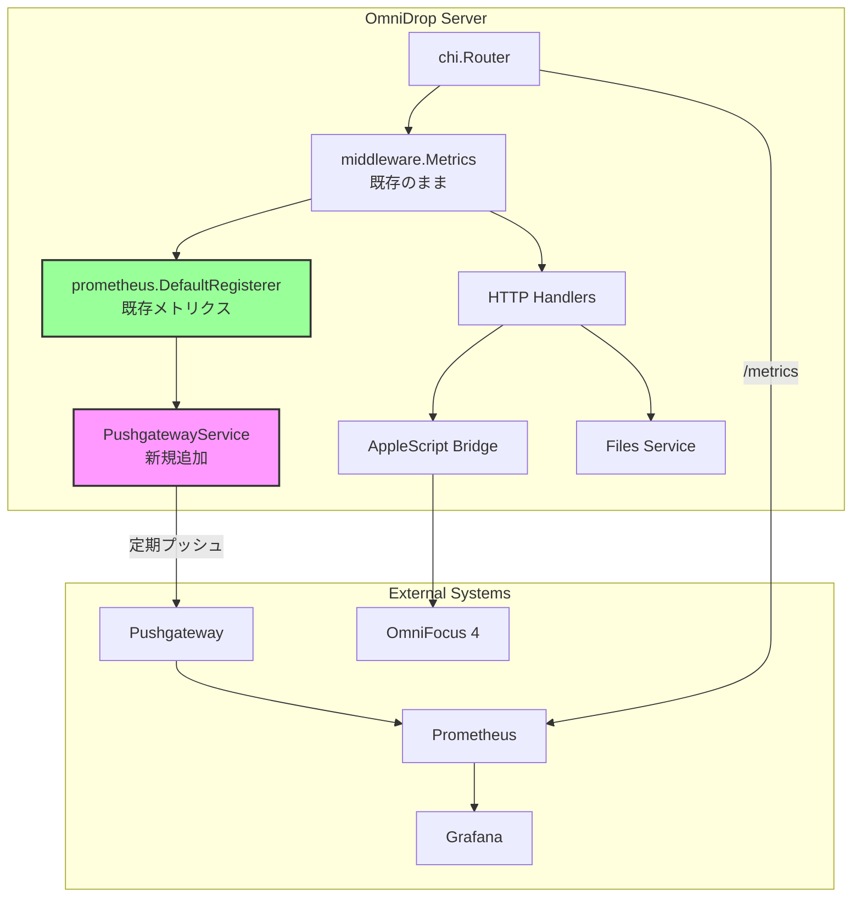
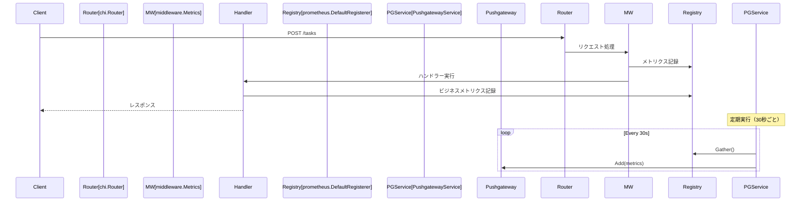

# OmniDrop Pushgateway統合設計書（改訂版）

## 1. 概要

### 1.1 背景と目的
OmniDropは既にPrometheusメトリクスを `internal/observability/metrics.go` で定義し、`/metrics` エンドポイントで公開している。本設計では、**既存のメトリクスをそのまま活用**し、Pushgatewayへ定期的に送信する機能を追加する。

### 1.2 設計方針
- **既存メトリクスの再利用**: 重複定義を避け、既存の `promauto.New*` で作成済みメトリクスを使用
- **chi.Routerとの調和**: 既存の `middleware.Metrics` はそのまま維持
- **正しいPushgateway API使用**: Gathererパターンで既存レジストリから収集
- **最小限の変更**: 既存コードへの影響を最小化

## 2. アーキテクチャ設計

### 2.1 修正後の全体構成



### 2.2 コンポーネント設計（修正版）

#### 2.2.1 PushgatewayService

```go
// internal/pushgateway/service.go
package pushgateway

import (
    "context"
    "log/slog"
    "time"

    "github.com/prometheus/client_golang/prometheus"
    "github.com/prometheus/client_golang/prometheus/push"
)

type Service struct {
    pusher       *push.Pusher
    interval     time.Duration
    logger       *slog.Logger
    enabled      bool
    stopCh       chan struct{}
    doneCh       chan struct{}
}

// Config holds the Pushgateway configuration
type Config struct {
    Enabled     bool
    URL         string
    Job         string
    Instance    string
    Interval    time.Duration
}

// NewService creates a new Pushgateway service
func NewService(cfg Config, logger *slog.Logger) (*Service, error) {
    if !cfg.Enabled {
        return &Service{enabled: false}, nil
    }

    // 既存のDefaultGathererを使用（重複定義を回避）
    pusher := push.New(cfg.URL, cfg.Job).
        Gatherer(prometheus.DefaultGatherer).
        Grouping("instance", cfg.Instance)

    return &Service{
        pusher:   pusher,
        interval: cfg.Interval,
        logger:   logger,
        enabled:  true,
        stopCh:   make(chan struct{}),
        doneCh:   make(chan struct{}),
    }, nil
}

// Start begins periodic pushing to Pushgateway
func (s *Service) Start() {
    if !s.enabled {
        return
    }

    go s.run()
    s.logger.Info("Pushgateway service started",
        slog.Duration("interval", s.interval))
}

// run is the main loop for periodic pushing
func (s *Service) run() {
    defer close(s.doneCh)

    ticker := time.NewTicker(s.interval)
    defer ticker.Stop()

    // Initial push
    s.push()

    for {
        select {
        case <-ticker.C:
            s.push()
        case <-s.stopCh:
            // Final push before stopping
            s.push()
            return
        }
    }
}

// push sends metrics to Pushgateway
func (s *Service) push() {
    ctx, cancel := context.WithTimeout(context.Background(), 10*time.Second)
    defer cancel()

    // Add() を使用して累積値を保持（Push()は全置換）
    if err := s.pusher.AddContext(ctx); err != nil {
        s.logger.Error("Failed to push metrics to Pushgateway",
            slog.String("error", err.Error()))
    } else {
        s.logger.Debug("Successfully pushed metrics to Pushgateway")
    }
}

// Stop gracefully stops the service
func (s *Service) Stop(ctx context.Context) error {
    if !s.enabled {
        return nil
    }

    close(s.stopCh)

    select {
    case <-s.doneCh:
        return nil
    case <-ctx.Done():
        return ctx.Err()
    }
}
```

#### 2.2.2 Application統合

```go
// internal/app/app.go への追加
package app

import (
    // ... existing imports ...
    "omnidrop/internal/pushgateway"
)

type Application struct {
    // ... existing fields ...
    pushgatewayService *pushgateway.Service  // 追加
}

func (a *Application) initialize() error {
    // ... existing initialization ...

    // Initialize Pushgateway service (optional)
    if a.config.PushgatewayEnabled {
        pgConfig := pushgateway.Config{
            Enabled:  true,
            URL:      a.config.PushgatewayURL,
            Job:      a.config.PushgatewayJob,
            Instance: a.config.PushgatewayInstance,
            Interval: a.config.PushgatewayInterval,
        }

        pgService, err := pushgateway.NewService(pgConfig, a.logger)
        if err != nil {
            a.logger.Warn("Failed to initialize Pushgateway service",
                slog.String("error", err.Error()))
        } else {
            a.pushgatewayService = pgService
            a.pushgatewayService.Start()
            a.logger.Info("✅ Pushgateway service initialized",
                slog.String("url", a.config.PushgatewayURL),
                slog.Duration("interval", a.config.PushgatewayInterval))
        }
    }

    // ... rest of initialization ...
    return nil
}

func (a *Application) shutdown() error {
    // ... existing shutdown logic ...

    // Stop Pushgateway service
    if a.pushgatewayService != nil {
        if err := a.pushgatewayService.Stop(ctx); err != nil {
            a.logger.Error("Error stopping Pushgateway service",
                slog.String("error", err.Error()))
        }
    }

    // ... rest of shutdown ...
    return nil
}
```

## 3. 既存メトリクスの活用

### 3.1 利用可能なメトリクス（変更なし）

既存の `internal/observability/metrics.go` で定義済みのメトリクスをそのまま使用：

| メトリクス名 | 説明 | 収集場所 |
|------------|------|---------|
| `omnidrop_http_requests_total` | HTTPリクエスト総数 | middleware.Metrics |
| `omnidrop_http_request_duration_seconds` | リクエスト処理時間 | middleware.Metrics |
| `omnidrop_task_creations_total` | タスク作成試行数 | handlers.CreateTask |
| `omnidrop_file_creations_total` | ファイル作成試行数 | handlers.CreateFile |
| `omnidrop_applescript_executions_total` | AppleScript実行数 | services.OmniFocusService |

### 3.2 メトリクス収集フロー



## 4. 環境設定

### 4.1 設定項目

```bash
# Pushgateway設定（オプション）
PUSHGATEWAY_ENABLED=false              # デフォルトは無効
PUSHGATEWAY_URL=http://localhost:9091
PUSHGATEWAY_JOB=omnidrop
PUSHGATEWAY_INSTANCE=${HOSTNAME:-localhost}
PUSHGATEWAY_INTERVAL=30s               # プッシュ間隔

# 環境別設定例
# Production (port 8787)
OMNIDROP_ENV=production
PUSHGATEWAY_ENABLED=true
PUSHGATEWAY_URL=http://metrics.prod.internal:9091
PUSHGATEWAY_INTERVAL=60s

# Development (port 8788)
OMNIDROP_ENV=development
PUSHGATEWAY_ENABLED=true
PUSHGATEWAY_URL=http://localhost:9091
PUSHGATEWAY_INTERVAL=30s

# Test (port 8789)
OMNIDROP_ENV=test
PUSHGATEWAY_ENABLED=false              # テスト時は無効
```

### 4.2 config.Config への追加

```go
// internal/config/config.go
type Config struct {
    // ... existing fields ...

    // Pushgateway configuration
    PushgatewayEnabled  bool          `envconfig:"PUSHGATEWAY_ENABLED" default:"false"`
    PushgatewayURL      string        `envconfig:"PUSHGATEWAY_URL" default:"http://localhost:9091"`
    PushgatewayJob      string        `envconfig:"PUSHGATEWAY_JOB" default:"omnidrop"`
    PushgatewayInstance string        `envconfig:"PUSHGATEWAY_INSTANCE"`
    PushgatewayInterval time.Duration `envconfig:"PUSHGATEWAY_INTERVAL" default:"30s"`
}
```

## 5. テスト設計

### 5.1 Pushgatewayモックテスト

```go
// internal/pushgateway/service_test.go
func TestPushgatewayService(t *testing.T) {
    // モックPushgatewayサーバーを起動
    mockServer := httptest.NewServer(http.HandlerFunc(func(w http.ResponseWriter, r *http.Request) {
        // メトリクスが正しく送信されたか確認
        assert.Equal(t, "/metrics/job/omnidrop/instance/test", r.URL.Path)
        assert.Equal(t, "POST", r.Method)

        // ボディを読み取って検証
        body, _ := io.ReadAll(r.Body)
        assert.Contains(t, string(body), "omnidrop_http_requests_total")

        w.WriteHeader(http.StatusOK)
    }))
    defer mockServer.Close()

    // テスト用設定
    cfg := Config{
        Enabled:  true,
        URL:      mockServer.URL,
        Job:      "omnidrop",
        Instance: "test",
        Interval: 100 * time.Millisecond,
    }

    // サービス作成・起動
    service, err := NewService(cfg, slog.Default())
    require.NoError(t, err)

    service.Start()

    // プッシュが実行されるまで待機
    time.Sleep(200 * time.Millisecond)

    // 停止
    ctx, cancel := context.WithTimeout(context.Background(), 1*time.Second)
    defer cancel()
    require.NoError(t, service.Stop(ctx))
}
```

### 5.2 統合テスト

```makefile
# Makefile への追加
test-pushgateway:
	@echo "Testing Pushgateway integration..."
	@docker run -d --name test-pushgateway -p 9091:9091 prom/pushgateway
	@OMNIDROP_ENV=test \
	 PORT=8789 \
	 PUSHGATEWAY_ENABLED=true \
	 PUSHGATEWAY_URL=http://localhost:9091 \
	 PUSHGATEWAY_INTERVAL=5s \
	 go test -v ./internal/pushgateway/...
	@docker stop test-pushgateway && docker rm test-pushgateway
```

## 6. 実装手順

### Phase 1: 基礎実装（2-3日）
1. [ ] `internal/pushgateway/service.go` の作成
2. [ ] `internal/config/config.go` へPushgateway設定追加
3. [ ] `internal/app/app.go` への統合

### Phase 2: テストとドキュメント（1-2日）
1. [ ] ユニットテストの作成
2. [ ] 統合テストの追加
3. [ ] README.md の更新

### Phase 3: 運用準備（1日）
1. [ ] docker-compose.yml にPushgateway追加（開発環境用）
2. [ ] Grafanaダッシュボードのサンプル作成
3. [ ] 運用ドキュメント更新

## 7. 主な変更点（初版からの修正）

### 7.1 メトリクス重複問題の解決
- ❌ **旧設計**: 新しいCollectorでメトリクスを再定義 → パニック発生
- ✅ **新設計**: `prometheus.DefaultGatherer` を使用して既存メトリクスを収集

### 7.2 ルーター統合の修正
- ❌ **旧設計**: `http.NewServeMux` と独自ミドルウェア前提
- ✅ **新設計**: 既存の `chi.Router` と `middleware.Metrics` をそのまま使用

### 7.3 Pushgateway APIの正しい使用
- ❌ **旧設計**: `map[string]interface{}` をバッファして送信
- ✅ **新設計**: `push.Pusher` に `Gatherer` を設定して既存レジストリから収集

## 8. 利点とトレードオフ

### 利点
- **最小限の変更**: 既存コードへの影響が極小
- **保守性**: メトリクス定義が一箇所に集約
- **互換性**: Pull型（`/metrics`）とPush型（Pushgateway）の両方をサポート
- **柔軟性**: 環境変数で簡単に有効/無効を切り替え可能

### トレードオフ
- **カスタマイズ性**: Pushgateway専用のメトリクスは追加できない
- **送信制御**: すべてのメトリクスが一括送信される（選択的送信は不可）
- **タイミング**: プル型とプッシュ型でメトリクスの更新タイミングに差が生じる可能性

## 9. 監視とアラート

### 9.1 Pushgatewayのヘルスチェック
```promql
# Pushgatewayへの最後のプッシュからの経過時間
time() - push_time_seconds{job="omnidrop"} > 120
```

### 9.2 メトリクス可視化
既存のGrafanaダッシュボードはそのまま使用可能。Pushgateway経由のデータも同じメトリクス名なので、データソースを追加するだけで対応可能。

## 10. まとめ

この改訂版設計では、既存のアーキテクチャとの調和を重視し、以下を実現：
- 既存メトリクスの再利用による重複回避
- chi.Routerとの自然な統合
- Pushgateway APIの正しい使用パターン
- 最小限のコード変更で最大限の機能追加

実装の複雑さを大幅に削減し、保守性を向上させた設計となっている。