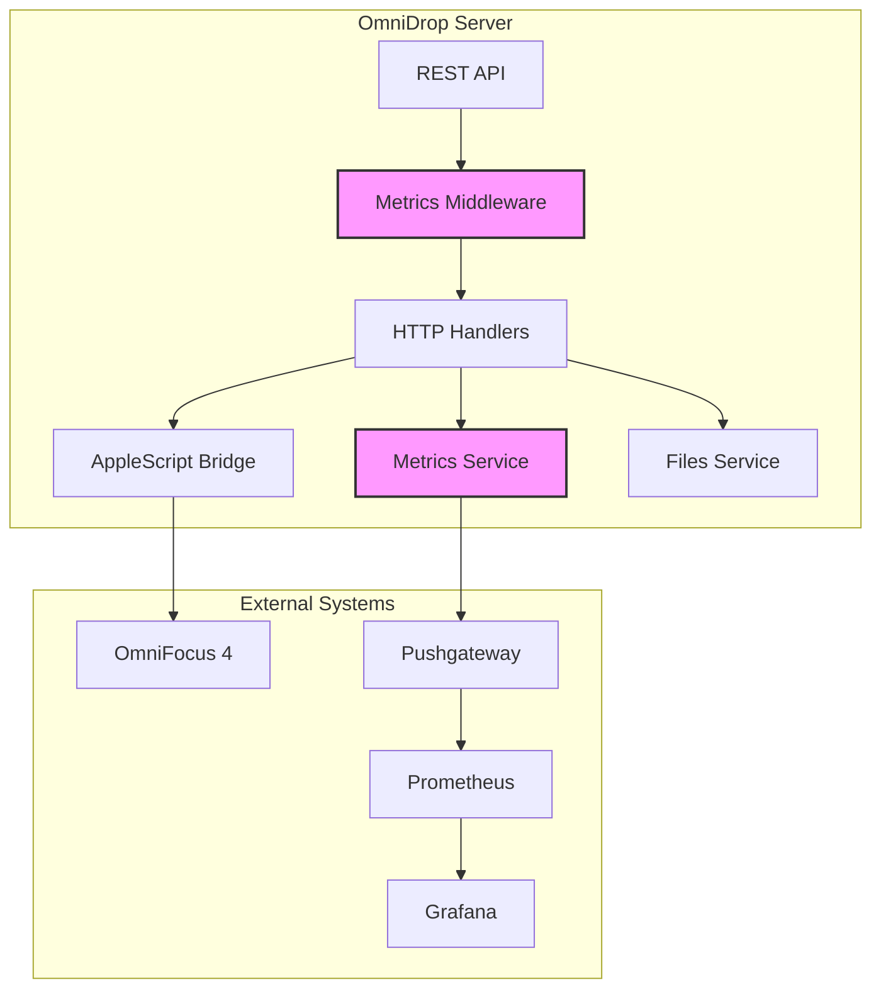
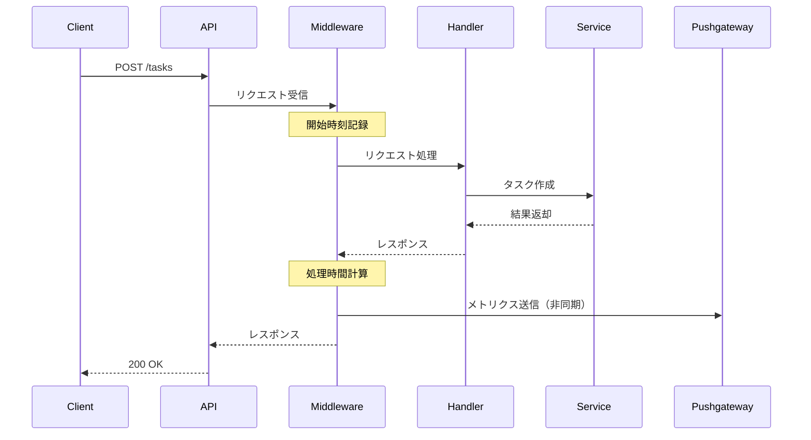
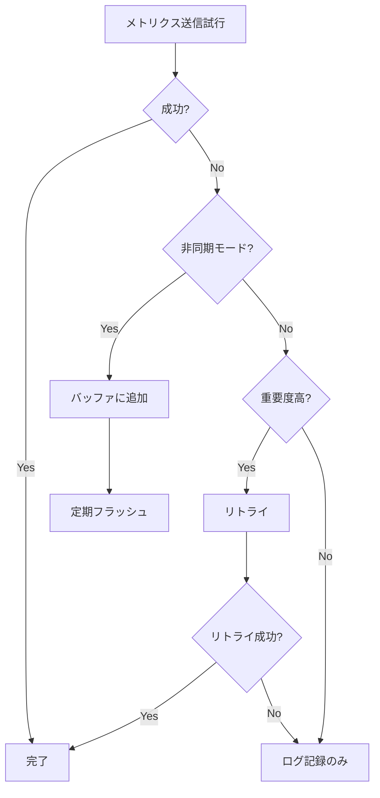

# OmniDrop Pushgateway統合設計書

## 1. 概要

### 1.1 目的
OmniDropサーバーにPrometheus Pushgatewayへのメトリクス送信機能を追加し、システムの監視性と可観測性を向上させる。

### 1.2 スコープ
- APIリクエストのメトリクス収集
- ビジネスメトリクスの追跡
- 環境別設定管理
- エラー処理とフォールバック機構

## 2. アーキテクチャ設計

### 2.1 全体構成



### 2.2 コンポーネント設計

#### 2.2.1 メトリクスコレクター

```go
// metrics/collector.go
package metrics

import (
    "github.com/prometheus/client_golang/prometheus"
    "github.com/prometheus/client_golang/prometheus/push"
)

type Collector struct {
    pusher           *push.Pusher
    enabled          bool
    asyncMode        bool
    bufferSize       int

    // メトリクス定義
    requestDuration  *prometheus.HistogramVec
    requestTotal     *prometheus.CounterVec
    taskCreated      *prometheus.CounterVec
    fileOperations   *prometheus.CounterVec
    errorTotal       *prometheus.CounterVec
}
```

#### 2.2.2 メトリクスサービスインターフェース

```go
// services/metrics.go
package services

type MetricsService interface {
    // HTTPメトリクス
    RecordHTTPRequest(method, path string, status int, duration float64)

    // ビジネスメトリクス
    RecordTaskCreation(project string, tags []string, success bool)
    RecordFileOperation(operation, directory string, success bool)

    // エラートラッキング
    RecordError(errorType, context string)

    // バッチ操作
    Flush() error
    Close() error
}
```

## 3. データフロー設計

### 3.1 メトリクス収集フロー



### 3.2 メトリクスの種類

#### 3.2.1 システムメトリクス

| メトリクス名 | タイプ | ラベル | 説明 |
|------------|--------|--------|------|
| `omnidrop_http_requests_total` | Counter | method, endpoint, status | HTTPリクエストの総数 |
| `omnidrop_http_request_duration_seconds` | Histogram | method, endpoint | リクエスト処理時間 |
| `omnidrop_active_connections` | Gauge | - | アクティブな接続数 |
| `omnidrop_errors_total` | Counter | type, endpoint | エラーの総数 |

#### 3.2.2 ビジネスメトリクス

| メトリクス名 | タイプ | ラベル | 説明 |
|------------|--------|--------|------|
| `omnidrop_tasks_created_total` | Counter | project, has_tags, has_due_date | 作成されたタスクの総数 |
| `omnidrop_files_created_total` | Counter | directory, extension | 作成されたファイルの総数 |
| `omnidrop_tags_usage` | Counter | tag_name | タグの使用頻度 |
| `omnidrop_project_distribution` | Counter | project_name | プロジェクト別のタスク分布 |

## 4. 実装設計

### 4.1 ディレクトリ構造

```
omnidrop/
├── main.go
├── internal/
│   ├── app/
│   │   └── app.go          # 既存のアプリケーション構造
│   ├── metrics/
│   │   ├── collector.go    # メトリクスコレクター実装
│   │   ├── middleware.go   # HTTPミドルウェア
│   │   ├── service.go      # メトリクスサービス実装
│   │   └── config.go       # 設定管理
│   └── handlers/
│       ├── tasks.go         # 既存（メトリクス呼び出し追加）
│       └── files.go         # 既存（メトリクス呼び出し追加）
└── tests/
    └── metrics_test.go      # メトリクステスト
```

### 4.2 環境設定

```bash
# 基本設定
METRICS_ENABLED=true
PUSHGATEWAY_URL=http://localhost:9091
PUSHGATEWAY_JOB=omnidrop
PUSHGATEWAY_INSTANCE=${HOSTNAME:-localhost}

# 詳細設定
METRICS_ASYNC=true                    # 非同期送信
METRICS_BUFFER_SIZE=100               # バッファサイズ
METRICS_FLUSH_INTERVAL=10s           # フラッシュ間隔
METRICS_TIMEOUT=5s                    # 送信タイムアウト

# 環境別設定
# Production (port 8787)
OMNIDROP_ENV=production
PUSHGATEWAY_URL=http://metrics.prod.internal:9091

# Development (port 8788)
OMNIDROP_ENV=development
PUSHGATEWAY_URL=http://localhost:9092

# Test (port 8789)
OMNIDROP_ENV=test
METRICS_ENABLED=false                 # テスト時は無効
```

### 4.3 初期化フロー

```go
// main.go での初期化
func main() {
    // 既存の設定読み込み
    config := loadConfig()

    // メトリクスサービスの初期化
    var metricsService services.MetricsService
    if config.MetricsEnabled {
        metricsService, err = metrics.NewService(metrics.Config{
            PushgatewayURL:  config.PushgatewayURL,
            JobName:        config.MetricsJob,
            Instance:       config.MetricsInstance,
            AsyncMode:      config.MetricsAsync,
            BufferSize:     config.MetricsBufferSize,
            FlushInterval:  config.MetricsFlushInterval,
        })
        if err != nil {
            log.Printf("Warning: Failed to initialize metrics: %v", err)
            metricsService = metrics.NewNoopService() // フォールバック
        }
    } else {
        metricsService = metrics.NewNoopService()
    }

    // ハンドラーにメトリクスサービスを注入
    handlers := &Handlers{
        metricsService: metricsService,
    }

    // ミドルウェアの設定
    mux := http.NewServeMux()
    mux.Handle("/tasks", metrics.Middleware(metricsService, handlers.HandleTasks))
    mux.Handle("/files", metrics.Middleware(metricsService, handlers.HandleFiles))
}
```

## 5. エラー処理設計

### 5.1 フォールバック戦略



### 5.2 エラー処理実装

```go
// メトリクス送信のエラー処理
func (c *Collector) safePush(metrics map[string]interface{}) {
    defer func() {
        if r := recover(); r != nil {
            log.Printf("Metrics push panic recovered: %v", r)
        }
    }()

    if c.asyncMode {
        select {
        case c.buffer <- metrics:
            // バッファに追加成功
        default:
            // バッファフル - 古いメトリクスを削除
            <-c.buffer
            c.buffer <- metrics
            c.recordDroppedMetrics()
        }
    } else {
        ctx, cancel := context.WithTimeout(context.Background(), c.timeout)
        defer cancel()

        if err := c.pusher.AddContext(ctx); err != nil {
            c.handlePushError(err)
        }
    }
}
```

## 6. テスト設計

### 6.1 テスト戦略

```go
// tests/metrics_test.go
type MockPushgateway struct {
    received []map[string]interface{}
    mu       sync.Mutex
}

func TestMetricsCollection(t *testing.T) {
    // モックPushgateway起動
    mock := startMockPushgateway(t, 9093)
    defer mock.Close()

    // テスト用サーバー起動
    server := startTestServer(t, TestConfig{
        Port:           8789,
        MetricsEnabled: true,
        PushgatewayURL: "http://localhost:9093",
    })
    defer server.Close()

    // APIリクエスト実行
    resp := createTask(t, server.URL, Task{
        Title:   "Test Task",
        Project: "Test Project",
        Tags:    []string{"test"},
    })

    // メトリクス確認
    assert.Eventually(t, func() bool {
        metrics := mock.GetMetrics()
        return len(metrics) > 0
    }, 5*time.Second, 100*time.Millisecond)
}
```

### 6.2 環境分離テスト

```makefile
# Makefile追加
test-metrics-isolated:
	@echo "Running isolated metrics tests..."
	@OMNIDROP_ENV=test \
	 PORT=8789 \
	 METRICS_ENABLED=true \
	 PUSHGATEWAY_URL=http://localhost:9093 \
	 go test -v ./tests/metrics_test.go

dev-with-metrics:
	@echo "Starting development server with metrics..."
	@OMNIDROP_ENV=development \
	 PORT=8788 \
	 METRICS_ENABLED=true \
	 PUSHGATEWAY_URL=http://localhost:9092 \
	 ./omnidrop-server
```

## 7. モニタリング設計

### 7.1 Prometheusクエリ例

```promql
# リクエストレート（5分間）
rate(omnidrop_http_requests_total[5m])

# 平均レスポンス時間
rate(omnidrop_http_request_duration_seconds_sum[5m]) /
rate(omnidrop_http_request_duration_seconds_count[5m])

# エラー率
rate(omnidrop_errors_total[5m]) /
rate(omnidrop_http_requests_total[5m])

# プロジェクト別タスク作成数
sum by (project) (omnidrop_tasks_created_total)
```

### 7.2 Grafanaダッシュボード構成

```json
{
  "dashboard": {
    "title": "OmniDrop Metrics",
    "panels": [
      {
        "title": "Request Rate",
        "type": "graph",
        "targets": [
          {
            "expr": "rate(omnidrop_http_requests_total[5m])"
          }
        ]
      },
      {
        "title": "Response Time (p95)",
        "type": "graph",
        "targets": [
          {
            "expr": "histogram_quantile(0.95, rate(omnidrop_http_request_duration_seconds_bucket[5m]))"
          }
        ]
      },
      {
        "title": "Task Creation by Project",
        "type": "piechart",
        "targets": [
          {
            "expr": "sum by (project) (omnidrop_tasks_created_total)"
          }
        ]
      }
    ]
  }
}
```

## 8. 段階的実装計画

### Phase 1: 基本実装（1週間）
- [ ] メトリクスパッケージの作成
- [ ] 基本的なHTTPメトリクスの実装
- [ ] 環境設定の追加
- [ ] NoOpサービスの実装（無効化時用）

### Phase 2: ビジネスメトリクス（1週間）
- [ ] タスク作成メトリクスの追加
- [ ] ファイル操作メトリクスの追加
- [ ] タグ・プロジェクト分析メトリクス

### Phase 3: 高度な機能（1週間）
- [ ] 非同期送信の実装
- [ ] バッファリングとバッチ処理
- [ ] リトライロジック
- [ ] メトリクス集約機能

### Phase 4: テストと最適化（3日）
- [ ] 包括的なテストスイート
- [ ] パフォーマンステスト
- [ ] ドキュメント更新
- [ ] Grafanaダッシュボード作成

## 9. セキュリティ考慮事項

- **認証情報の保護**: Pushgateway URLには認証情報を含めない
- **機密データの除外**: 個人情報やタスクの詳細内容はメトリクスに含めない
- **ネットワーク分離**: 本番環境のPushgatewayは内部ネットワークのみアクセス可能
- **レート制限**: メトリクス送信頻度の制限実装

## 10. パフォーマンス考慮事項

- **非同期処理**: API応答をブロックしないよう非同期送信
- **バッファリング**: 小規模メトリクスをバッファして一括送信
- **タイムアウト**: Pushgateway接続に適切なタイムアウト設定
- **フォールバック**: Pushgateway障害時もサービスは継続動作